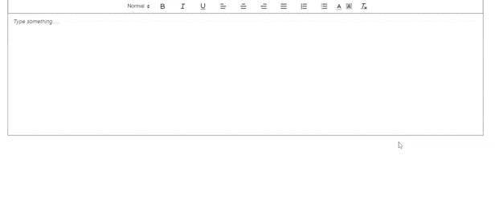

# ReactJS - CKEditor / WYSIWYG Editor

A simple, native and easy-to-use WYSIWYG / Rich Text editor built in Quill.js and React.js

## Table of contents

- [Browser Support](#browser-support)
- [Demo](#demo)
- [Getting started](#getting-started)
- [Usage](#usage)
- [Available Props](#available-props)
- [Methods](#methods)
- [Want to Contribute?](#want-to-contribute)
- [Collection of Components](#collection-of-components)
- [Changelog](#changelog)
- [Credits](#credits)
- [License](#license)
- [Keywords](#Keywords)

## Browser Support

|  |  |  |  |  |
| ---------------------------------------------------------------------------------------- | ------------------------------------------------------------------------------------------- | ---------------------------------------------------------------------------------------- | ---------------------------------------------------------------------------------- | ---------------------------------------------------------------------------------------------------------------------------- |
| 83.0 ✔                                                                                   | 77.0 ✔                                                                                      | 13.1.1 ✔                                                                                 | 83.0 ✔                                                                             | 11.9 ✔                                                                                                                       |

## Demo

[](https://github.com/weblineindia/ReactJS-CK-Editor/editor.gif)

## Getting started

Install the npm package:

```bash
npm install react-weblineindia-ck-editor
#OR
yarn add react-weblineindia-ck-editor
```

## Usage

Use the `<react-weblineindia-ck-editor>` component:

```js
import React, { Component } from "react";
import Editor from "react-weblineindia-ck-editor";
class Test extends Component {
  constructor(props) {
    super(props);
    this.state = {
      editorHtml: "",
    };
  }

  handleChange(html) {
    this.setState({
      editorHtml: html,
    });
  }

  render() {
    return (
      <div>
        <Editor
          onChange={this.handleChange.bind(this)}
          value={this.state.editorHtml}
          bounds=".app"
          placeholder="Type Something"
        />
      </div>
    );
  }
}
export default Test;

```

## Available Props

| Name                  | Type    | Default                                              | Description                                                                            |
| --------------------- | ------- | ---------------------------------------------------- | -------------------------------------------------------------------------------------- |
| id                    | String  | quill-container                                      | Set the id (necessary if multiple editors in the same view)                            |
| placeholder           | String  | -                                                    | Placeholder text for the editor                                                        |
| value               | String  | -                                                    | Set value to the the content or data property you wish to bind it to                 |
| modules             | object   |                                                    | Set modules    |
| toolbar              | Array  |                                                   | Set toolbar   |
| formats               | Array  |                                                   | Set formats   |

## Methods

| Name             | Parameters                   | Description                                                                         |
| ---------------- | ---------------------------- | ----------------------------------------------------------------------------------- |
| blur             | quill                        | Emitted on `blur` event                                                             |
| focus            | quill                        | Emitted on `focus`  event               |
| onChange      |                   | Emitted on `change` event                                              |
| onKeyPress      |                   | Emitted on `keypress` event                                              |
| onKeyDown      |                   | Emitted on `keydown` event                                              |
| onKeyUp      |                   | Emitted on `keyup` event                                              |

## Want to Contribute?

- Created something awesome, made this code better, added some functionality, or whatever (this is the hardest part).
- [Fork it](http://help.github.com/forking/).
- Create new branch to contribute your changes.
- Commit all your changes to your branch.
- Submit a [pull request](http://help.github.com/pull-requests/).

---

## Collection of Components

We have built many other components and free resources for software development in various programming languages. Kindly click here to view our [Free Resources for Software Development](https://www.weblineindia.com/software-development-resources.html)

---

## Changelog

Detailed changes for each release are documented in [CHANGELOG.md](./CHANGELOG.md).

## Credits

react-weblineindia-ck-editor is inspired by [react-quill](https://www.npmjs.com/package/react-quill).

## License

[MIT](LICENSE)

[mit]: https://github.com/weblineindia/ReactJS-CK-Editor/blob/master/LICENSE

## Keywords

react-weblineindia-ck-editor, react-ck-editor, reactjs-ck-editor, react-editor, react-ckeditor, rich-text-editor, wysiwyg-editor, reactjs-wysiwyg
